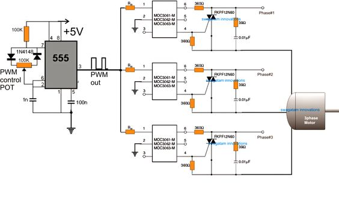

# 1- Headings

How to draw heading in markdown?
# Heading 1
## HEADING 2
### HEADING 3

# 2 - Block of words
> This is for block of words 
>
> add your text here 
>
>hi
# 3 - Line break 
THis is for learninhg python ka chilla with expert people \
i line it very much and you will see how forward slash works \
in this language 
# 4 - Merge two blocks
> ## Heading 2

# 5 - bold italic bold and italic
__Bold__ \
**BOLT** \
*ITALIC* \
_ITALIC_ \
***Bold and italic***
# 6 - Bullet point and nummbering
> 1. Day 1 
> 2. Day 2 
> 3. Day 3 \
>       3.1 day 3a

- python
- matlab 
- c++
- vascode 
- anaconda
# 7 - Line Break and Page Break
This is Page 1.
___
***
---
This is page 2
# 8 - Link and Hyperlinks

<https://www.fiverr.com/users/khushal43/seller_dashboard> \
[This is my fiver link](https://www.fiverr.com/users/khushal43/seller_dashboard)

[Fiver aaccount]:https://www.fiverr.com/users/khushal43/seller_dashboard

Kindly do vist [here][Fiver aaccount]

# 9 - Figures and links
To see my design circuit see the below picture \


To see online image 


# 10 - adding code block
To print a string `print("Hello Python")`
```Python
x=10
y=11
z=x+y
print(z)
```
> The above code color is sae as python

# 11 - Table adding 
| Header 1 | **Header 2** | Header 3 |
|:----------:|----------:|:----------|
| Row 1, Col 1 | Row 1, Col 2 | Row 1, Col 3 |
| Row 2, Col 1 | Row 2, Col 2 | Row 2, Col 3 |
| Row 3, Col 1 | Row 3, Col 2 | Row 3, Col 3 |
| Row 4,col 1 | Row 4,col 2   |  Row 4,col 3 |

# 12 - Contents
> 1. [Heading 1](#heading-1) 
> 2. [Block of words](#2---block-of-words)
> 3. [Line break ](#3---line-break)
